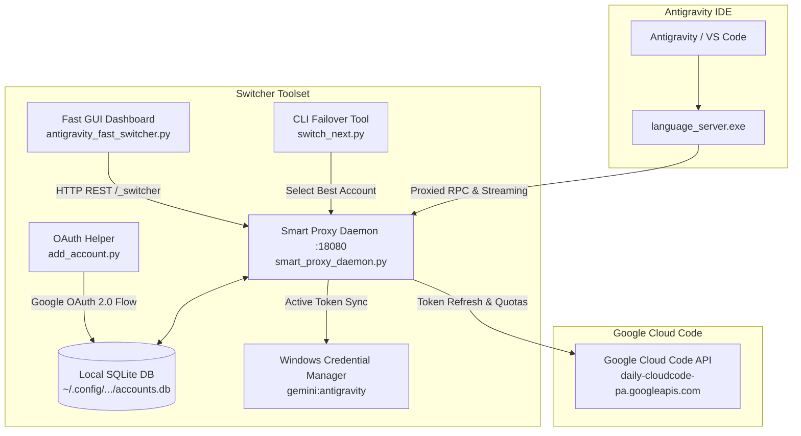

# Antigravity Multi-Account Switcher & Quota Dashboard ⚡

[](https://www.python.org/)
[](https://www.microsoft.com/windows)
[](https://customtkinter.tomschimansky.com/)
[](https://opensource.org/licenses/MIT)

An advanced, high-performance desktop application and intelligent background proxy designed for Google Antigravity. It enables seamless, zero-interruption multi-account rotation, real-time 3-tier quota tracking, and automatic rate-limit failover.

---

## 🌟 Key Features

- **⚡ Zero-Interruption Hot Switching**: Switch active Google accounts on the fly without restarting the IDE or killing ongoing agent tasks.
- **📊 3-Tier Real-Time Quota Telemetry**:
  - **Gemini 5-Hour**: Immediate short-window request quota with countdown reset.
  - **Gemini Weekly**: Long-term rolling quota monitor.
  - **Claude / GPT Weekly**: Model-specific tier quota tracking.
- **🔄 Smart Auto-Rotation & Failover**: Automatically selects the account with the highest composite score whenever an account approaches limit exhaustion or encounters HTTP 429 / 403.
- **🖥️ Flicker-Free Modern Dark UI**: Built with CustomTkinter. Refreshes in-place every 60 seconds without widget destruction or window stutter.
- **🔑 Seamless 1-Click OAuth Onboarding**: Built-in OAuth2 local listener handles Google login, token exchange, and local encrypted credential persistence.
- **🛡️ 100% Local & Privacy-Preserving**: All tokens and accounts are stored strictly in your local user directory (`~/.config/antigravity-account-switcher/accounts.db`). Zero cloud telemetry.

---

## 🏗️ Architecture



---

## 📦 File Structure

| File | Description |
| :--- | :--- |
| `antigravity_fast_switcher.py` | Modern desktop GUI dashboard with 60s in-place quota monitoring and manual switch triggers. |
| `smart_proxy_daemon.py` | High-performance reverse proxy (port 18080) with dynamic account routing and quota tracking. |
| `add_account.py` | Local web listener (port 8085) for onboarding Google accounts via OAuth 2.0. |
| `switch_next.py` | Command-line script to immediately switch to the account with the highest available quota. |
| `run_gui.bat` | One-click silent Windows launcher for the GUI (`pythonw`). |
| `start_daemon.bat` | One-click silent Windows launcher for the daemon background process (`pythonw`). |
| `add_account.bat` | Convenient shortcut to trigger account addition. |
| `switch_next.bat` | Convenient shortcut to execute highest-quota failover. |
| `requirements.txt` | Python runtime dependencies. |

---

## 🚀 Getting Started

### Prerequisites

- **OS**: Windows 10 or Windows 11 (64-bit)
- **Python**: Python 3.10 or newer (ensure `python` and `pip` are added to your PATH)
- **IDE**: Google Antigravity

### 1. Installation

Clone this repository or extract the release archive:

```bash
git clone https://github.com/Osama-Alzahrani-UQU/antigravity-account-switcher.git
cd antigravity-account-switcher
```

Install dependencies:

```bash
pip install -r requirements.txt
```

### 2. Onboard Your Google Accounts

You can add multiple Google accounts using either method:
- **Via GUI**: Launch the GUI and click the **+ Add Account** button.
- **Via CLI / Batch**: Double-click `add_account.bat` or run:
  ```bash
  python add_account.py
  ```
  A browser window will open asking for your Google consent. Once authorized, the account is securely saved locally.

> [!IMPORTANT]
> **Adding a Second Account (or Additional Accounts):**  
> To add a second account (or any subsequent account), you must completely close/exit the application and reopen/restart it before initiating the process to add the next account.

### 3. Running the Switcher

- **GUI Dashboard**: Double-click `run_gui.bat` (or execute `python antigravity_fast_switcher.py`).
  - View all registered accounts, their live quota gauges, and active status.
  - Click **Switch to This Account** next to any account to switch instantly.
  - Toggle **Auto-Rotation** to enable automatic switching when limits deplete.
- **Command-Line Switcher**: Double-click `switch_next.bat` (or execute `python switch_next.py`) to rotate automatically to the best account.

---

## 🔒 Security & Privacy

- **No Hardcoded Tokens**: This repository contains zero account credentials, tokens, or personal identifiers.
- **Local Storage**: All account tokens are stored strictly on your local disk in:
  ```
  %USERPROFILE%\.config\antigravity-account-switcher\accounts.db
  ```
- **Windows Credential Manager Integration**: Active credentials are synchronized directly into the Windows Credential Store under `gemini:antigravity`.

---

## 📜 License

This project is licensed under the MIT License - see the [LICENSE](LICENSE) file for details.

---

<details dir="rtl">
<summary><b>دليل الاستخدام باللغة العربية (انقر للتوسيع)</b></summary>

# أداة التبديل الذكية ومراقبة الحصص لحسابات Antigravity ⚡

برنامج مخصص لبيئة تطوير Google Antigravity يتيح إدارة وتبديل حسابات Google المتعددة في الخلفية دون أي انقطاع في سير العمل البرمجي، مع مراقبة دقيقة ومباشرة لنسب الاستخدام والحصص المتبقية.

### المميزات الرئيسية:
1. **تبديل فوري بدون انقطاع**: تبديل الحساب النشط فوراً دون الحاجة لإعادة تشغيل بيئة التطوير أو إيقاف مهام الذكاء الاصطناعي الجارية.
2. **شاشة مراقبة لحظية للحصص**:
   - حصة Gemini لفترة 5 ساعات مع عد تنازلي لموعد التصفير.
   - حصة Gemini الأسبوعية التراكمية.
   - حصص نماذج Claude و GPT الأسبوعية.
3. **تحديث سلس ومستقر**: تحديث تلقائي كل 60 ثانية (دقيقة) في نفس مكان العناصر دون وميض أو تذبذب في الواجهة.
4. **تدوير ذكي عند اقتراب النفاذ**: عند وصول الحساب لحدود الاستهلاك أو استلام خطأ 429/403، يتم التبديل التلقائي إلى الحساب الأكثر توفراً للحصة.
5. **إضافة الحسابات بنقرة زر**: تسجيل دخول آمن عبر Google OAuth 2.0 وحفظ محلي مشفر.

### طريقة التشغيل:
1. قم بتثبيت المتطلبات عبر الأمر:
   ```bash
   pip install -r requirements.txt
   ```
2. لتشغيل الواجهة الرسومية: اضغط مرتين على ملف `run_gui.bat`.
3. لإضافة حساب جديد: اضغط على زر **+ Add Account** في الواجهة، أو شغل `add_account.bat`.

> [!IMPORTANT]
> **ملاحظة هامة عند إضافة حساب ثانٍ (أو حسابات إضافية):**
> لإضافة حساب ثانٍ أو أي حساب إضافي، يجب إغلاق البرنامج بالكامل ثم إعادة تشغيله قبل البدء في إضافة الحساب الجديد.

4. للتبديل الفوري لأفضل حساب عبر سطر الأوامر: شغل `switch_next.bat`.

</details>
